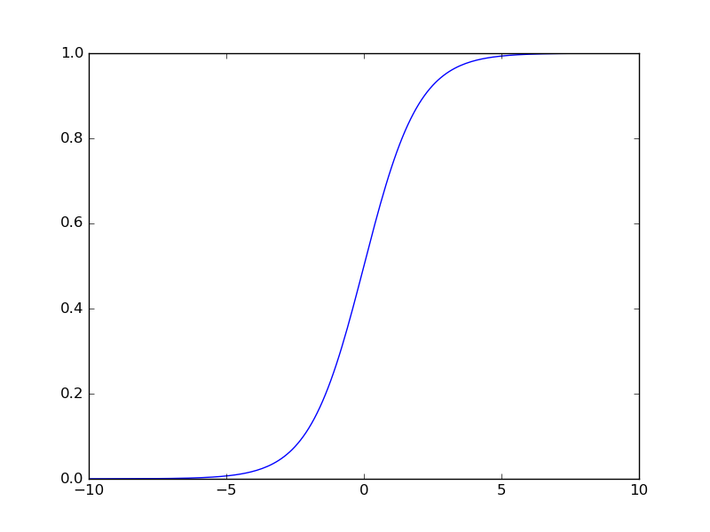

# Back propagation method

## note

You can edit `ROW` means ρ, `EPOCH` means how many times it learn,

and Neural Network architecture.

In Neural Network archtecutre, 

- `num_of_layer` means the number of layers. 

For example, `num_of_layer : 3` means you want to make 3-layers networks.

- `input_layer` means input data dimentions.

For example, `input_layer : 2` means input data has two dimentions data.

- `hidden_layerN` (N=1,2,...) means No.N hidden layer dimentions.

For example, `hidden_layer1 : 3` means No.1 hidden layer has three dimentions.

You can make the number of hidden layer.

- `output_layer` means the number of output dimentions.

For example, `output_layer : 3` means output layer has three dimentsions, or 

you want to classify data three.

## activation function

### tanh

### sigmoid

### ReLU(Rectified Linear Unit)

